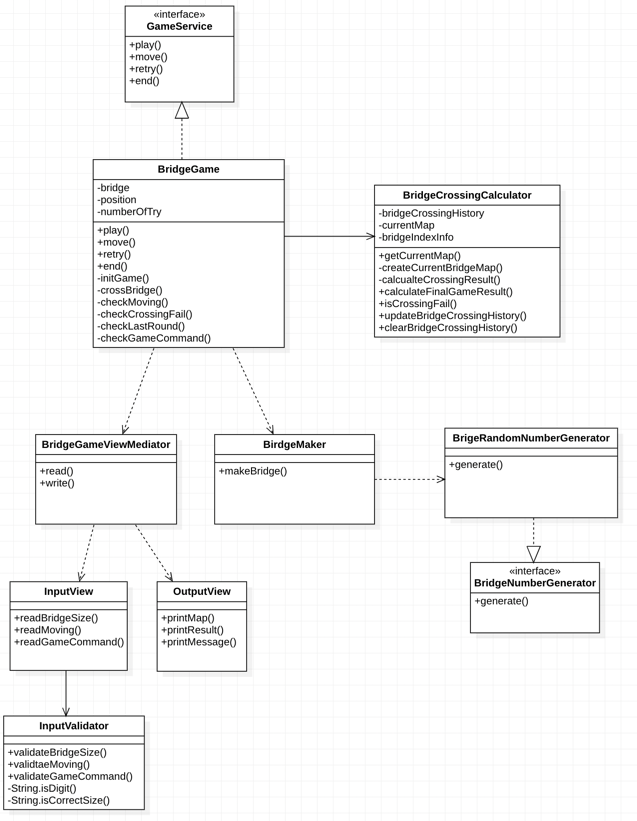

## Function Specification 🚀

### 게임 시작
- [x] 게임 시작 문구를 출력한다.
- [x] 다리의 길이를 숫자로 입력받는다.
  - [x] `3` 이상 `20` 이하의 값을 입력받고, 올바른 값이 아니면 예외처리 한다.
- [x] `0`은 아래칸, `1`은 위칸으로 해서 건널 수 있는 무작위 다리를 생성한다.

###  게임 진행
- [x] 다리가 생성되면 매 라운드마다 플레이어에게 이동할 칸을 입력받는다.
  - [x] 이동할 때 위 칸은 `U`, 아래 칸은 `D`를 입력받고, 올바른 값이 아니면 예외처리 한다.
- [x] 이동한 칸을 건널 수 있다면 `O`을, 건널 수 없다면 `X`를 표시한다.

### 게임 종료
- [x] 다리를 끝까지 건너면 게임이 종료된다.
- [x] 다리를 건너다 실패하면 게임을 재시작하거나 종료할 수 있다.
  - [x] 재시작은 `R`, 종료는 `Q`를 입력받고, 올바른 값이 아니면 예외처리 한다.
  - [x] 재시작해도 처음에 만든 다리 정보를 재사용한다.
  - [x] Q를 누르면 게임을 완전히 종료한다.
- [x] 게임이 종료되면 `최종 게임 결과`와 `게임 성공여부`, `총 시도한 횟수`를 출력한다.

### 예외 상황
- [x] 잘못된 입력값에 대해 `IllegalArgumentException`를 발생시키고, "[ERROR]"로 시작하는 에러 메시지를 출력 후 그 부분부터 입력을 다시 받는다.

---
## Implementation 🎲

### Class Diagram


### Class

#### BridgeGame 
```
다리 건너기 게임 상황을 관리하는 클래스
```
- `bridge: List<String>`
- `position: Int`
- `numberOfTry: Int`

3개의 프로퍼티를 가지고 있다.
- 게임이 시작되면 다리 정보를 생성하고 알고 있어야 하는 책임을 가진다.
- 유저가 다리를 건너면 현재 움직임을 변경하는 책임을 가진다.
- 게임 `실행`, `재시도`, `종료` 등의 진행 상황을 관리하는 책임을 가진다.

#### BridgeCrossingCalculator
```
사용자가 다리를 건넌 후 결과를 계산하는 클래스
```
- `bridgeCrossingHistory: MutableList<Pair<Moving, Boolean>>`
- `currentMap: MutableList<String>`
- `bridgeIndexInfo: HashMap<Int, Int>`

3개의 프로퍼티를 가지고 있다.
- 유저가 입력한 무빙 정보에 따라 `현재 다리를 잘 건넜는지 계산`하고 그 내역을 알고 있어야 하는 책임을 가진다.
- 현재 게임 결과 내역을 가지고 `맵을 계산`하는 책임을 가진다.
- 다리를 건넌 내역을 가지고 `게임 결과(성공, 실패)를 계산`하는 책임을 가진다.
- 만약 현재 다리 사이즈가 2(위, 아래)가 아니라 변경되게 된다면 상수 값 및 `bridgeIndexInfo`를 변경해서 맵 출력을 조정할 수 있다.

#### BridgeGameViewMediator
```
게임과 게임에 사용되는 뷰들을 연결하는 클래스
```
- `View` 클래스에는 `readBridgeSize`, `readMoving`, `printMap`, `printResult` 등 다양한 종류의 입출력 함수가 존재한다.
- `BridgeGame`에서는 직접 `View`의 다양한 메서드를 호출하지 않고 오직 `read` 및 `write` 메서드만 호출하여 게임에 필요한 입출력을 처리한다.

- `BridgeGame`에서 입력이 필요할 때는 다음과 같이 사용할 수 있다.
- 받을 입력의 종류(enum)을 통해 `Mediator`에서 호출할 메서드를 분기한다.
```kotlin
       val moving = bridgeGameViewMediator.read(inputType = InputType.MOVING) // 무빙 입력 받는다.
```

- `write` 메서드는 오버로딩으로 정의하여, `BridgeGame`에서 받는 인자로 출력 로직을 구별할 수 있다.
```kotlin
    fun write(message: String) {
        outputView.printMessage(message = message)
    }

    fun write(mapInfo: List<String>) {
        outputView.printMap(mapInfo = mapInfo)
    }

    fun write(mapInfo: List<String>, gameSuccessResult: String, numberOfTry: Int) {
        outputView.printResult(mapInfo = mapInfo, gameSuccessResult = gameSuccessResult, numberOfTry = numberOfTry)
    }
```

### directory
```
🎁
.
├── common
├── domain
│   ├── calculator
│   ├── game
│   ├── mediator
│   └── moving
└── ui
    ├── validator
    └── view
```

---
## Test 🔧
`gradlew.bat clean test` 로 테스트한다.

### BridgeGameTest
- 사용자가 다리에서 움직이는 로직을 처리하는 `move()` 메서드를 테스트 하고 싶으나, 기존의 코드는 아래와 같았다.
- 사용자가 움직이는 로직 뿐만 아니라
  1. 무빙 커맨드를 입력받고 
  2. 무빙 정보를 업데이트 하고 
  3. 유저 위치를 변경하고 
  4. 무빙에 대한 맵을 출력하는 것까지
한 메서드에서 다양한 일을 수행하고 있었다.
```kotlin
   fun move() { 
        // 유저 무빙 입력 받는 로직
        // ...
       
        // 유저 무빙 내역을 업데이트 하는 로직
        // ...
  
        // 현재 유저 위치를 변경하는 로직
        position++
  
        // 유저 무빙에 대한 맵을 출력하는 로직
        // ...
    }
```

- `move()`를 수행함으로써 사용자의 `position`이 잘 변경되는 지 확인하려면 아래처럼 리팩토링 할 수 있다.
-  사용자의 moving을 확인하는 `checkMoving` 메소드를 분리하고, `move`에서는 정말 움직임만 변경하도록 한다.
```kotlin
private fun checkMoving() {
  // 유저 무빙 입력 받는 로직
  // ...

  // 유저 무빙 내역을 업데이트 하는 로직
  // ...

  // 현재 유저 위치를 변경하는 로직
  move()

  // 유저 무빙에 대한 맵을 출력하는 로직
  // ...
}

override fun move() {
    position++
}
```

- 아래와 같이 `move`를 테스트할 수 있다.
```kotlin
    @BeforeEach
    fun setUp() {
        // ...
        
        // Given
        bridgeGame = BridgeGame(bridgeGameViewMediator = bridgeGameViewMediator, bridgeMaker = bridgeMaker)
    }

    @Test
    fun `사용자가 다리를 건넌 뒤 포지션이 증가하는지 테스트`() {
        // When
        bridgeGame.move()
        bridgeGame.move()

        //Then
        Assertions.assertThat(bridgeGame).extracting("position").isEqualTo(2)
    }
```

### BridgeCrossingCalculatorTest
- 사용자가 다리를 건넌 내역 (history) 정보를 가지고 있고, 이 정보를 통해 맵이 잘 그려지는지 테스트하고 싶었다.
- 기존에는 `outputView`에서 map 정보를 넘겨받아서 출력하도록 했는데,
- 이렇게 된다면 맵 정보를 테스트하기 어렵다는 문제가 있다.
- 그리고 맵 정보를 계산 및 생성하는 로직이 포함되어 있기 때문에 한 메서드가 한가지 역할만을 하는 것에 위배되게 된다.
```kotlin
class OutputView() {
    fun printMap(BridgeCrossingHistory: List<Pair<Moving, Booelan>>, bridge: List<String>) {
        // 맵 정보를 생성하는 로직
        // ...
        
        // 맵 정보를 출력하는 로직
        print(map)
    }
}
```

- map 정보를 테스트하고 싶다면, 맵 정보를 생성하는 책임을 다른 클래스에게 위임할 수 있다.
- BridgeCrossingCalculator 클래스에서 다음과 같이 맵 정보를 반환하는 `getCurrentMap` 메서드를 만들 수 있다.
```kotlin
fun getCurrentMap(): List<String> { 
  currentMap.clear()

  repeat(BRIDGE_ROW_SIZE) { bridgeIndex ->
    currentMap.add(createCurrentBridgeMap(bridgeIndexInfo[bridgeIndex]!!))
  }
  return currentMap
}
```

- 그리고 OutputView에서는 맵 정보를 '출력'하는 역할만 할 수 있다.
```kotlin
    fun printMap(mapInfo: List<String>) {
        mapInfo.forEach { map ->
            println(map)
        }
    }
```

- 그리고 테스트 시에 다음과 같이 맵이 잘 생성되는지 테스트 코드를 작성할 수 있는 것이다.
```kotlin
   @Test
    fun `현재까지 건넌 다리 정보에 대해 맵이 잘 생성되는지 확인`() {
        Assertions.assertThat(
            BridgeCrossingCalculator.getCurrentMap()
        ).isEqualTo(
            listOf(
                "[ O |   | X ]",
                "[   | O |   ]"
            )
        )

        val upSideIndex = BridgeCrossingCalculator.getCurrentMap().indexOf("[ O |   | X ]")
        val downSideIndex = BridgeCrossingCalculator.getCurrentMap().indexOf("[   | O |   ]")

        Assertions.assertThat(upSideIndex).isEqualTo(0)
        Assertions.assertThat(downSideIndex).isEqualTo(1)
    }
```

---
## Convention ❄️
- [코틀린 코딩 컨벤션](https://kotlinlang.org/docs/coding-conventions.html#properties)
- [코틀린 스타일 가이드](https://developer.android.com/kotlin/style-guide?hl=ko)
- [자바 스타일 가이드](https://google.github.io/styleguide/javaguide.html)
- [클린 코드 체크 리스트 ](https://github.com/woowacourse/woowacourse-docs/blob/main/cleancode/pr_checklist.md)
- [커밋 메세지 컨벤션](https://gist.github.com/stephenparish/9941e89d80e2bc58a153)

- InteliJ kotlin formatting을 활용하여 프로그래밍 한다.